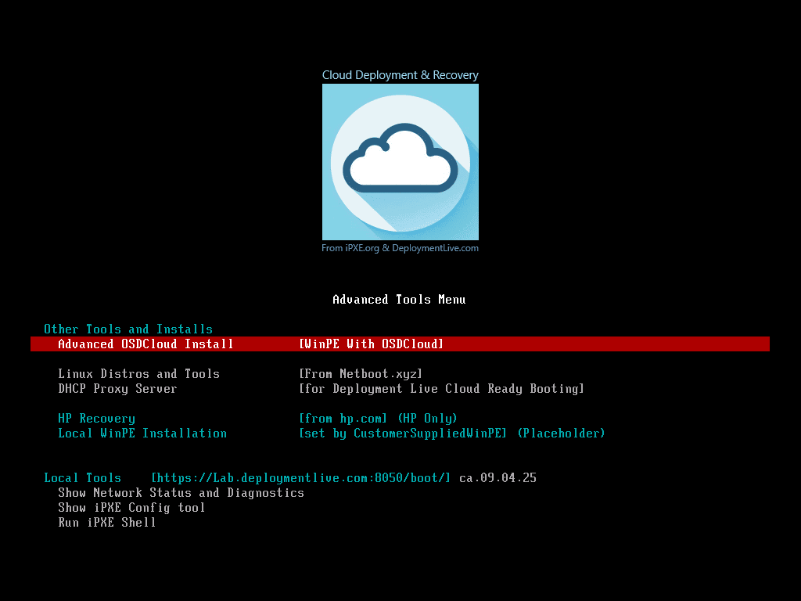

# Deployment Live iPXE Cloud Ready Deployment and Recovery - Administration Guide

- [Deployment Live iPXE Cloud Ready Deployment and Recovery - Administration Guide](#deployment-live-ipxe-cloud-ready-deployment-and-recovery---administration-guide)
  - [Introduction](#introduction)
    - [What you need to get started](#what-you-need-to-get-started)
    - [Secure Boot](#secure-boot)
    - [Certificates](#certificates)
  - [Starting Deployment Live iPXE Software](#starting-deployment-live-ipxe-software)
    - [Starting from USB Sticks](#starting-from-usb-sticks)
    - [Starting from PXE](#starting-from-pxe)
    - [Starting from DHCP Proxy (PXE)](#starting-from-dhcp-proxy-pxe)
    - [Starting from HTTPS](#starting-from-https)
      - [HP](#hp)
      - [Dell/Lenovo/Others](#delllenovoothers)
    - [Starting from Recovery Environment](#starting-from-recovery-environment)
  - [iPXE Internals](#ipxe-internals)
    - [Internal Operations of iPXE Embedded Script](#internal-operations-of-ipxe-embedded-script)
  - [Cloud Operations Guide](#cloud-operations-guide)
    - [Backup Desktop Operating System](#backup-desktop-operating-system)
    - [OSD Cloud Installation](#osd-cloud-installation)
    - [Deployment Live iPXE Advanced Tools](#deployment-live-ipxe-advanced-tools)
  - [Thanks!](#thanks)
  - [More resources](#more-resources)


## Introduction

This guide is designed to help you setup the administrative infrastructure for the 
**Depoyment Live iPXE Cloud Ready Deployment and Recovery** solution. 

If you are looking for more information on what **Depoyment Live iPXE Cloud Ready Deployment and Recovery** *actually* does, please consult our [Evaluation Guide](evalguide.md).

If you are curious about how this tool looks like from a end-user perspective, please consult our [Users Guide](usersguide.md).

### What you need to get started

To prepare the administrative infrastructure, we will need to determine what your use cases are and what your environment looks like. 

* **Are most of your workers at home, or are they in an office?**</br>
If they are in the office, we should setup Network Booting (PXE), otherwise we may need to prepare for USB sticks or other methods to pre-install iPXE (See Staring Deployment Live iPXE Software below).
* **Do you have an existing PXE environment? Are you looking to replace or augment?**</br>
If you have a pre-exsisting environment, we may need to modify the environment, or setup a new environment with dnsmasq. 
* **Can we make changes to your DHCP environment? Can we add custom DHCP Entries?**</br>
If you have configuration access to your DHCP Server, best to add there. Otherwise, we may be able to setup a DHCP Proxy server to answer DHCP Boot requests. 
* **Do you have an existing SCCM OSD, MDT, PSD, or other Windows Installation tool?**</br>
If so, we can configure the PXE bootstrapper to pre-configure your internal WinPE source.
* **Do you have a volume licensing server? Do you use AutoPilot? Do you have Windows Provisioning Packages?**</br>
If so, we can configure the PXE bootstrapper to auto-select the right Windows SKU when installing Windows.

### Secure Boot

First a note about Secure Boot. Most modern machines are setup to **ONLY** boot from Microsoft Secure Boot Approved EFI executables. **Depoyment Live iPXE Cloud Ready Deployment and Recovery** has been signed by then Microsoft 3rd party EFI Secure Boot CA, so it is approved and will run on most Secure Boot protected machine.

However, there are some Notes:
* You can check on your local machine to see if Secure Boot is enabled, simply run `msinfo32.exe` and look at the `Secure Boot` Entry.
* You can also run the powershell cmdlet `Confirm-SecureBootUEFI` in an elevated window.
* **BIOS and CSM** - Deployment Live iPXE does not support BIOS mode or CSM mode. All modern machines support UEFI, and you should be using UEFI with Secure Boot enabled.
* **Hyper-V** - Microsoft Hyper-V only supports booting from *either* the Microsoft 3rd Party EFI Secure Boot CA, or the Windows EFI Secure Boot CA, **but not both**. Meaning that if you Enable Secure Boot using the 3rd Party EFI CA, you will be able to boot to Deployment Live iPXE, but **NOT** Windows PE (WinPE). It is therefore recommended that you disable Secure-Boot when installing Windows on Hyper-V.
* **Windows Secure Core** - [Windows Secure Core](https://learn.microsoft.com/en-us/windows-hardware/design/device-experiences/oem-highly-secure-11) PCs are shipped by default with the Microsoft 3rd Party UEFI CA turned **OFF**. Deployment Live iPXE will require the 3rd Party UEFI CA turned **ON**. Please work with your OEM to ensure the right settings are enabled. 
* Most of the https://netboot.xyz entries will NOT be available for use if Secure Boot is enabled.
### Certificates 

The Free version of Deployment Live iPXE only trusts one CA TLS/SSL certificate for HTTPS communications, This CA is manged by Deployment Live LLC. https://www.deploymentlive.com/boot/ca.crt

Notes:
* https://boot.deploymentlive.com:8050 has been setup as a web service bound to this certificate.
* You can also load this Certificate Authorith on UEFI machines that support HTTPS booting. (More on this later)
* This certificate does not block communication using DeploymentLive iPXE TFTP or HTTP.
* Once Deployment Live iPXE has passed control to either Windows PE or Linux Live, we no longer need the certificate, and can use regular HTTPS on port 443 for full communication. 
* It is possible to cross-sign any site with the Deployment Live CA certificate.
* If you have a custom Internet facing HTTPS site, and would like to have secure communications between Deployment Live iPXE, and your web site, please contact us at: info@deploymentlive.com

## Starting Deployment Live iPXE Software 

Deployment Live iPXE is a small EFI executable that is around 300Kb to 500kb in size.
The idea is that we can load it up quickly from a nearby source, and then it will be 
responsible for loading additional files through HTTP/HTTPS.

### Starting from USB Sticks

Since Deployment live iPXE is a UEFI executable, we can simply name it as \EFI\BOOT\BOOTX64.EFI and 
it will be visible to the local EFI system during boot-up. However, Deployment Live iPXE doesn't know
where to go next, so we *also* place an autoexec.ipxe file at the root of the USB stick to let iPXE know where the cloud installation system is located. 

Check the [Users Guide](usersguide.md) for the download links for some ISO images. These ISO images can work easily in a Virtual Machine, or you can copy the contents to a USB stick using the [Rufus](https://rufus.ie) Tool. 

There are also tools on this Github Repo in the /Block folder that allow you to create your own ISO images.

### Starting from PXE

Deployment Live iPXE can easily be lunched from existing PXE infrastructure.

* If you have a DHCP Server running on Windows Server, follow the guide at: [Setup PXE in a Microsoft Environment](../PXE/readme.md)
* If you have a unix server running dnsmasq, you can follow the guide at: [Setup PXE in a dnsmasq environment](../PXE/dnsmasq.md)

What's important to note is that you need to specify two DHCP `filename` values. 

* While the machine is first booting, you will want the DHCP Server to point to our `snp_x64.efi` or `snp_aa64.efi` file.
* Then while Deployment Live iPXE is running, it will send out **another** DHCP request ( this time with DHCP option 175, and user_class = 'ipxe' ), so now is the time to return the path to our ipxe control script in the `filename` value. 

The official entrypoint for free version of `Deployment Live iPXE` is `https://boot.deploymentlive.com:8050/boot/cloudboot.ipxe`

Dnsmasq example:
```
dhcp-userclass=set:ipxe,iPXE
dhcp-boot=tag:ipxe,autoexec.ipxe

pxe-service=tag:!ipxe,x86-64_EFI,x64PXE,snp_x64.efi
pxe-service=tag:!ipxe,ARM64_EFI,aa64PXE,snp_aa64.efi
```

### Starting from DHCP Proxy (PXE)

Please consult our [DHCP Proxy guide](admin-dhcpproxy.md) for more information on how to boot using a 2nd DHCP Server with your existing DHCP infrastructure.

### Starting from HTTPS

One of the most advanced methods for starting Deployment Live iPXE is to embed the path to the EFI executables directly into the machine firmware. That allows home users to boot to Deployment Live iPXE over the network even if they are working from home. No USB Sticks, no PXE servers.

`Future: This is advance setup. more to come`

The provisioning guides are Manufacturer independent:

#### HP

Some HP scripts are available under the `OEM\HP` folder of this github repo.

#### Dell/Lenovo/Others

`Future: TBD`

### Starting from Recovery Environment

It's possible to setup iPXE as a backup boot entry for the Windows Recovery Environment. 

`FUTURE: It is possible to  boot from the local WinRE instance, and then launch iPXE.`

## iPXE Internals

### Internal Operations of iPXE Embedded Script

Within the **Deployment Live iPXE** EFI executable, there is an embedded script to handle startup and other tasks.

The logcial flow is as follows:

* Before the Network has started...
  * Test to see if current path `${cwduri}` is set to an `http` source. If so, then `set force_filename ${cwduri}\cloudboot.ipxe`
  * Test to see if iPXE has found an `autoexec.ipxe` file, typical when booting from USB sticks. If so, then launch this file, it should set `force_filename` to the full path of the cloudboot script.
* Then, initialize the network...
  * If `${force_filename}` was set above, then try calling this iPXE script. 
  * If `${force_filename}` was **NOT** set above, then call the ipxe command `autoboot` .
    * autoboot will attempt to initialize the network and will try to launch the `filename` or `rootpath` script. The Deployment Live iPXE script will attempt to perform `autoboot` 10 times.
  * If none of the steps above were successful, then the Deployment Live iPXE embedded script will notifiy the user of an error, allow the user to break into some diagnostic screens, otherwise it will attempt to retry the network initialization again.

Reference: 

* https://github.com/DeploymentLive/iPXEBuilder/blob/main/customers/DeploymentLive/Assets/embedded.sh
* https://github.com/ipxe/ipxe/blob/969ce2c559a6841a949a1b73a3967b1889e0c999/src/usr/autoboot.c#L391

## Cloud Operations Guide

When we boot to the Deployment Live Cloud, we should see several entries:

```
Repair or Install Windows Operating System
Run a Backup Desktop Operating System

...

Advanced Tools Menu ...
...
```

### Backup Desktop Operating System

Run a backup desktop operating system that does NOT require anything from the existing hard disk.

Currently this is set as Ubuntu Live 22.04 KDE Desktop Environment from https://netboot.xyz, and is Secure Boot signed.

Note that this is a Live version of Linux running in memory, so anything saved to the local desktop won't be saved to the local hard disk. Make sure you save your files to the right location.

The goal of this environment is to provide customers with the ability to use their PC during a large scale outage, say for example a malware attack, or CrowdStrike Bug scenario where a lot of PC's no longer boot. This gives IT deparments cover so users can get back to work, and the IT department can work on a corporate wide solution.

### OSD Cloud Installation

Built into **Deployment Live iPXE Cloud Ready Deployment and Recovery** is the OSD Cloud Installation tool from https://OSDeploy.com.

Simply selecting `Repair or Instal a Windows Operating System` at the main Deployment Live iPXE menu screen will automatically boot to a SecureBoot ready WinPE instance. 

After starting WinPE, we automatically start OSD Cloud and users can run through the menu system.

<!-- Future - add in custom wizard pages for deployment. -->

### Deployment Live iPXE Advanced Tools

After booting to Deployment Live iPXE, you can select the `Advanced Tools` menu at the bottom of the screen.



The Advanced tools represent several tools for IT Administrators, not typically for end users.

They include:

* **Advanced OSDCloud Install**</br>
This is a series of iPXE input pages that allow you to enter in all the necessary parameters necessary for OSD Cloud. Why? When done, you can press enter, and the rest of the process should be automated. See Customizing OSD Cloud install below for more information.
* **Linux Distros and Tools** (Requires Secure Boot to be OFF)</br>
This will launch the http://netboot.xyz menu pages.
* **DHCP Proxy Server** (Requires Secure Boot to be OFF)</br>
Will launch a custom Live version of Tiny Core Linux, with dnsmasq to support Proxy DHCP. 
See [DHCPProxy](admin-dhcpproxy.md) for more information
* **HP Recovery**(Requires running on a HP machine)</br>
HP offers a WinPE recovery image live from their web site. We can directly launch that WinPE instance here. 
* **Local WinPE Installation**</br>
Optionally we can define an additional WinPE image to be used in installation, available locally. See the [autoexec](admin-autoexec.md) guide for information on the settings required.

-----
* **Show Network Status and diagnostics**</br>
A simple page showing common network status and other settings
* **Show iPXE Config Tool**</br>
This will run the iPXE config tool. Very helpful to show all the current
built-in variables defined by iPXE itself.
* **Run iPXE Shell**</br>
This will run the iPXE shell. A Basic command line interface for iPXE. For advanced users only. Documentation at: [iPXE Command Line](https://ipxe.org/cmdline)


## Thanks!

Hopefully this should help you get started in restoring your machine. 

Please let us know if you have any feedback on this guide.

info@deploymentlive.com

## More resources

* [Users Guide](usersguide.md)
* [Evaluation Guide](EvalGuide.md)
* [Administrators Guide](AdminGuide.md)
  * [Admin AutoExec.ipxe](admin-autoexec.md)
  * [Admin DHCP Proxy](admin-dhcpproxy.md)
* [Frequently Asked Questions](faqguide.md)
