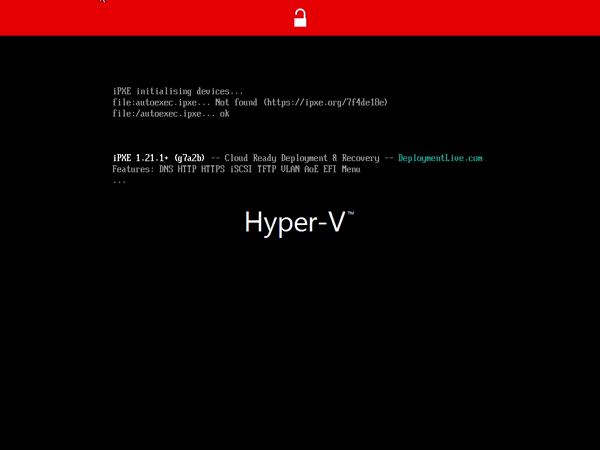
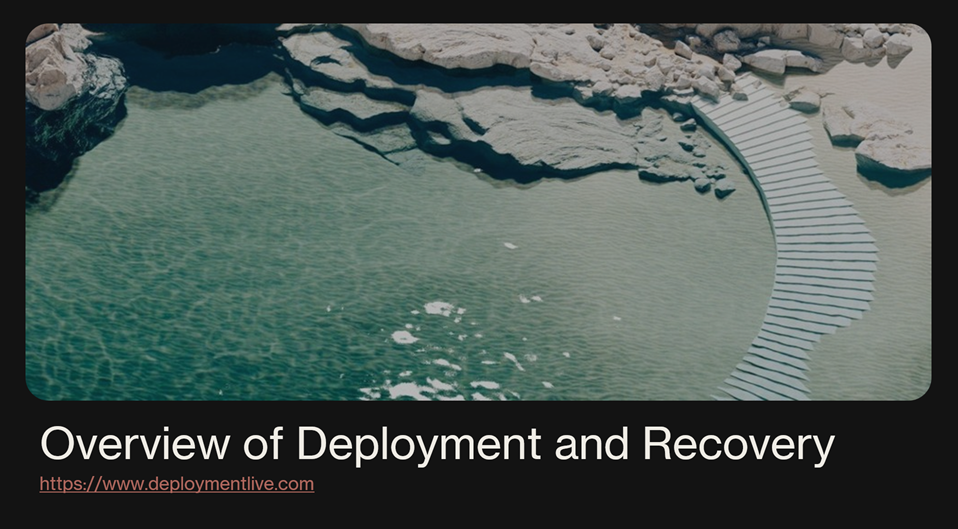

# Deployment Live iPXE Cloud Ready Deployment and Recovery - Evaluation Guide

- [Deployment Live iPXE Cloud Ready Deployment and Recovery - Evaluation Guide](#deployment-live-ipxe-cloud-ready-deployment-and-recovery---evaluation-guide)
  - [Introduction](#introduction)
  - [Walk Through](#walk-through)
    - [Create a USB Boot Key.](#create-a-usb-boot-key)
    - [Configure your existing PXE Server](#configure-your-existing-pxe-server)
    - [Setting up a new DHCP Proxy Server.](#setting-up-a-new-dhcp-proxy-server)
  - [Setting up a test machine](#setting-up-a-test-machine)
    - [Scenario 1 - Boot to Linux](#scenario-1---boot-to-linux)
    - [Scenario 2 - Recovery Tools](#scenario-2---recovery-tools)
    - [Scenario 3 - Full Wipe.](#scenario-3---full-wipe)
  - [What's so special about this software?](#whats-so-special-about-this-software)
    - [The Fine Print...](#the-fine-print)
  - [What if I want to do more](#what-if-i-want-to-do-more)
    - [Extending the existing public cloud to your internal site.](#extending-the-existing-public-cloud-to-your-internal-site)
    - [Creating your own external facing cloud recovery system.](#creating-your-own-external-facing-cloud-recovery-system)
  - [Thanks!](#thanks)
  - [More resources](#more-resources)

## Introduction 

**Depoyment Live iPXE Cloud Ready Deployment and Recovery** is an easy way to Deploy and Recover machines at scale over the Internet.

Best of all, the public cloud version is free to use.

At the core of this system is the [iPXE](https://ipxe.org) tool. 
iPXE is a **network bootloader** designed to start quickly from USB or Network, it's small, only 300Kb to 500Kb in size. 



From Power on to the first menu in 5-10 seconds!

Once loaded, it can load several tools or recovery solutions:
* We can boot to WinPE/WinRE to start [OSDCloud](https://www.osdcloud.com/)
  - OSD Cloud is a free OS deployment tool that can install a new version of Windows 10/11 on your machine from OS  source images downloaded directly from Microsoft.
* We can boot to WinPE/WinRE to start some recovery scenarios 
  - `FUTURE: Bitlocker Unlock, etc...`
* We can boot to Linux/Ubuntu Live Desktop over the internet.

All of this can be done without touching the local hard disk:
* So if you are under a Malware attack
* Malfunctioning software (like the Crowdstrike bug)
* Or other scenario where the local Operating System is not working.

We have you covered.

## Walk Through

[](https://www.youtube.com/watch?v=jTNvMBDL1tA)

### Create a USB Boot Key.

If you have a spare USB key lying around, this may be an easy way to get started. 

Check out our [user's guide](usersguide.md#prepare-usb-flash-drive). Rufus works well to setup USB sticks.

If you need to use a USB to Ethernet Adapter, then please use the `prodUSBx64.iso` or `prodUSBarm64.iso` files.

**However** please note that if you do not have a USB to Ethernet adapter, best to use `prodNETx64.iso` or `prodUSBarm64.iso` files, 
as some laptops may loose USB Keyboard functionality. 

### Configure your existing PXE Server

If you already have a PXE server, then our [Administrators Guide](adminguide.md#starting-from-pxe) can help you set that up.

This is recommended for larger managed networks.

### Setting up a new DHCP Proxy Server.

If you don't want to configure an existing DHCP server for evaluation (yuck, I don't blame you), we can easily setup a pre-existing DHCP Proxy Server.
A DHCP Proxy server can sit along side your existing DHCP environment, and only pass out the PXE boot 
portions. The DHCP Proxy Server will not allocate IP Address. 

It's not really best for large managed Networks, but will work great for small networks, like your home network. 

To start, go ahead and create a Virtual Machine:
* If you are running Hyper-V Make sure you have an **External** switch defined connected to your network (Wired Preferred).
* Then create a Virtual Machine with:
  * 1GB of Ram
  * Gen 2 with Secure Boot turned OFF.
  * No disk required
  * Virtual DVD: https://www.deploymentlive.com/iso/ProdNETamd64_DHCP.iso

or you can run this PowerShell script:
```
#Requires -RunAsAdministrator
# Create iPXE DHCP Proxy (No Disk,1GB RAM)

[cmdletbinding()]
param(
    $Name = 'iPXE DHCP Proxy',    
    $SwitchName = ( Get-VMSwitch -SwitchType External | Select -first 1 -ExpandProperty Name ),
    $ISOPath
)

if ( !$ISOPath ) { 
    $ISOPath = "$env:temp\DeploymentLiveiPXE_x64.iso"
    Invoke-WebRequest -Uri 'https://www.deploymentlive.com/iso/ProdNETamd64_DHCP.iso' -OutFile $ISOPath
}

New-VM $Name -SwitchName $SwitchName -gen 2 -BootDevice 'CD' | Write-Verbose
Set-VMFirmware -VMName $Name -EnableSecureBoot off # Running Unsigned Linux
Set-VMDvdDrive -VMname $Name -path $ISOPath
Start-VM -name $Name
```

Once running, we should now have a DHCP Proxy Network Boot Server.

## Setting up a test machine

Now we need to setup a test machine to try out our PXE server.

`WARNING: Note that Hyper-V won't let us Secure Boot to BOTH iPXE and Windows. So we will DISABLE Secure here too.`

Create a Virtual Machine with:
  * 8GB of Ram
  * Gen 2 with Secure Boot turned OFF.
  * 128GB Disk
  * Boot to Network (PXE)

### Scenario 1 - Boot to Linux

Say for example a user has a malfunctioning computer, We suspect malware, but more investigation is required.
The User is complaining that they need to get work done this morning.

Let's boot up the new Virtual Machine. Once we see the Main Menu, let's select **Run a Backup Desktop** Operating System. It may take 2-3 minutes to start, but soon we will have a functioning desktop environment. 

Now your users can get work done, while we try to figure out what to fix. 

### Scenario 2 - Recovery Tools

Say you have been hit with a CrowdStrike Style bug. The machine is still usable, but we just need to fix one persistent bug. 

Let's boot up the new Virtual Machine. Once we see the Main Menu, let's select **Repair or Install** Windows Operating System 

Once we are within WinPE, we now have access to a command window, and can perform repairs.

<!-- FUTURE: Planning is under way for some end-user ready tools for WinPE. This should include BitLocker unlock portals, and other tools. Please let us know if you have any suggestions or requirements. -->


### Scenario 3 - Full Wipe.

Well say you've been hit by some Ransomware, luckily all your users have been saving files to OneDrive, so the decision has been made to just wipe all computers with a new Operating System.

We will be using OSDCloud for Re-Installation. We already have a Windows Provisioning Package for our Organization. AutoPilot will handle the rest.

One of the advanced things we can do on the DHCP Proxy Server is to pre-setup some defaults for OSDCloud. That way end-users don't need to choose which Edition of Windows 11 they need to install.
We can also setup up custom USB Sticks or ISO images to perform similar tasks.

See [Custom DHCP Proxy Settings](adminguide.md#custom-winpe-image)

## What's so special about this software? 

**Deployment Live iPXE** has been signed by Microsoft as a trusted binary for Secure Boot.  Meaning that you don't have to turn **OFF** Secure Boot if you need to network boot or recover over the internet.

Additionally we are making this software free for use, including our cloud recovery and deployment tools.  Please no redistributing, download from https://www.deploymentlive.com.

We believe that the Cloud is a better place to execute Recovery and Deployment Solutions. 
And with the ability of **Deployment Live iPXE** to boot from Secure Boot, and to connect over HTTPS (encrypted), 
the era of true network recovery is here.

### The Fine Print...

There is one caveat, the **Deployment Live iPXE** secure-boot signed binaries will only trust the **Deployment Live CA** HTTPS TLS/SSL Certificate. 
This allows us to connect to the https://boot.deploymentlive.com:8050 site and a few others, but no other HTTPS encrypted sites are supported.

This shouldn't be a problem if you are running internally, on a private network, just connect to your un-encrypted HTTP web server. 

The Free version of **Deployment Live iPXE** is not intended to connect up to other 3rd party HTTPS encrypted sites.

## What if I want to do more

In practical terms, iPXE can be use to connect to the public https://boot.deploymentlive.com:8050 site with encrypted HTTPS, 
but if you want to do more then you may need your site trusted with Deployment Live free version, or our Enterprise version. 
Please contact us at info@deploymentlive.com

### Extending the existing public cloud to your internal site. 

There are several ways we can extend the free Public Cloud offering if you have more resources internally on your private network.

* We can add a menu item for your private WinPE boot image (MDT,ConfigMgr,PSD, More... )
* We can customize the OSDCloud installation Experience...
* Additionally we can setup any custom iPXE menu system running off of http (Unencrypted).

Please see our [Administrators Guide](adminguide.md)

### Creating your own external facing cloud recovery system.

If you would like to setup Custom https communication with your own private HTTPS (encrypted) server, please contact us.

## Thanks!

Hopefully this should help you get started in restoring your machine. 

Please let us know if you have any feedback on this guide.

info@deploymentlive.com

## More resources

* [Users Guide](usersguide.md)
* [Evaluation Guide](EvalGuide.md)
* [Administrators Guide](AdminGuide.md)
  * [Admin AutoExec.ipxe](admin-autoexec.md)
  * [Admin DHCP Proxy](admin-dhcpproxy.md)
* [Frequently Asked Questions](faqguide.md)
