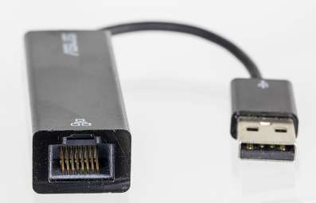

# Deployment Live iPXE Cloud Ready Deployment and Recovery - User's Guide

- [Deployment Live iPXE Cloud Ready Deployment and Recovery - User's Guide](#deployment-live-ipxe-cloud-ready-deployment-and-recovery---users-guide)
  - [Introduction](#introduction)
  - [What you need to get started](#what-you-need-to-get-started)
    - [Prepare USB Flash Drive](#prepare-usb-flash-drive)
  - [Starting Deployment Live iPXE Software](#starting-deployment-live-ipxe-software)
  - [Staring the Recovery Process](#staring-the-recovery-process)
    - [Running a backup Operating System](#running-a-backup-operating-system)
    - [Installing a New Windows Operating System](#installing-a-new-windows-operating-system)
  - [Thanks!](#thanks)
  - [More resources](#more-resources)


## Introduction

Oh no, did something bad happen to your machine? Does it no longer boot? 
Have you been infected by Malware?

If so, then you have come to the right place.  **Deployment Live iPXE Cloud Ready Deployment and Recovery** 
Solution was designed to help real people like you get back to work on your Windows Personal Computer (PC).

We can ignore the state of your local Hard Disk, since our solution uses the lightweight [iPXE](https://ipxe.org) tool.
iPXE can be started quickly over the network, and then loads other powerful tools to fix or bypass your machine! Get back to work, faster!

Of course, **Deployment Live iPXE Cloud Ready Deployment and Recovery** is very powerful, but we recommend that you only perform 
certain tasks under the direct guidance of your IT department, as some of the tasks can be destructive. 

<!--Future: How-to Video -->

## What you need to get started

We are going to need your Machine, with a network cable connected to your local network.

<!--Future: Document how to setup full Wi-Fi experience. Not currently supported -->

If your machine does not have an Ethernet Network Port, you may need a USB to Ethernet Adapter.



Your IT Administrator may have already setup your machine to boot from the network directly. If so,continue to the next step, otherwise we will need to setup a USB Boot Device using a USB Flash Drive.

### Prepare USB Flash Drive

Do you have a USB to Ethernet Adapter to connect to your wired internet connection?

If so, please use the **USB** version of our media, otherwise if you can plug in your wired internet connection directly into your laptop, use the **NET** version.

|Description|url|
|----|----|
|Boot image for USB Ethernet Adapters|https://www.deploymentlive.com/Block/ProdUSBDual.iso|
|Boot image for built in Ethernet|**https://www.deploymentlive.com/Block/ProdNETDual.iso** <-- Most Common|

Dual Means that it supports Windows on Intel x64, AMD x64, and Arm64 machines.
For other downloadable images, check [here](adminguide.md)

After downloading you can copy the software to USB key using the [Rufus](https://rufus.ie) Tool. Rufus will wipe the USB Flash Drive, format for Fat32, and copy the necessary files.

However, if you would like to copy the files manually, you can easily copy the files to a Fat32 formatted USB stick (Not a NTFS formatted stick), with these files:

|Files||
|----|----|
|`\autoexec.ipxe`|For calling the Cloud Service|
|`\EFI\BOOT\BOOTX64.EFI`|For x64 (Intel and AMD)|
|`\EFI\BOOT\BOOTAA64.EFI`|For arm64 (Optional)|

## Starting Deployment Live iPXE Software

Go ahead and plug your machine into the local network.
If you have a USB Key, insert it now.

Normally, when you turn on your machine, it will boot directly to your local Disk. 
However, if your local Operating System is not working, we will need to tell your machine to boot
into **Deployment Live iPXE Cloud Ready Deployment and Recovery** instead.

Otherwise, we will need to interrupt your normal PC startup process by pressing a special key on your keyboard. 
This will usually happen between 3 to 15 seconds of starting your machine. You may need to continuously tap the key, once or twice a second.
If you see the spinning circle, you may be too late.

|Manufacturer/OEM|Instructions|
|----------------|------------|
|HP|Press `F9` for `Boot Device Options`</br> or Press `Esc` for the `Startup Menu`|
|Dell|Press `F12` while booting to enter the `One Time Boot Menu`|
|Lenovo|Pressing either `F12` or `Enter` to enter the `Boot Menu`.|
|Surface|Press `Volume Down` while turning on to boot from USB.|
|AMI|Press either `F7` to enter the `Boot Menu`</br>or press `Enter` for the `BIOS Menu`|
|Others|Please consult your Manufacturer|

**NOTE:** *If your IT department has given you specific instructions to boot into recovery, please follow those instructions now.*

You should now see your USB Stick in the list of available devices in the `Boot Menu`. Go ahead and select now.

## Staring the Recovery Process

Once we start,
it should look something like this:


As you can see, the boot process is pretty quick! When we first see the **Deployment Live** Logo with the clouds, 
the system is setting up your network and trying to get a network IP address. If we can't reach out on the network, we might get an error here.

Then once the network is initialized, we are now connected to the Cloud Service, and we can select some  actions:
```
Repair or Install Windows Operating System
Run a Backup Desktop Operating System

...
```

We now need to think about what needs to be done to your machine...

### Running a backup Operating System

If you don't know **exactly** what to do, you might just want to startup another Desktop Operating System so you can do some work.

Selecting: `Run a Backup Desktop Operating System` from the menu page will start up a new Desktop Operating System. It's running a version of Linux (Ubuntu Live 22.04 KDE), that has been designed to closely mimic what Windows Looks like.

From here, you may not be able to access your local files if your drive is encrypted, but you will be able to start a Web Browser and connect to your web based e-mail, messaging, and line of business web apps.

`WARNING: Anything you save on the local desktop **will** be deleted when you reboot the machine. Bring a USB Key, or save your data back to the cloud.`

Hopefully you can use this Backup Desktop while your IT department is trying to determine the best fix your PC problems.

### Installing a New Windows Operating System

Once you are ready to fix or replace your existing operating System, we can select `Repair or Install Windows Operating System`. This option will start up the Windows Pre-Installation Environment (WinPE) to begin. 

<!--Future: Add in notes about Remediation tools-->

For installing a new Operating System, your IT department may have specific instructions. Otherwise we can use the wizards to to guide you through the process.

`WARNING: Installing a new Operating System is a destructive process.`

This process works best if you have been saving data onto your local cloud resources like OneDrive or Google Cloud. If not then you might want to consult with your IT department, on how to best to save your data before you continue with Installing a new Operating System.

We use [OSDCloud](https://www.osdeploy.com/) to re-image machines. Thanks Dave!

<!--Future: Add in documentation about OSD Cloud installation-->

OSD Cloud can be configured by your IT department to install Windows, Hardware Drivers, and other important Line of Business Apps, all automatically!

## Thanks!

Hopefully this should help you get started in restoring your machine. 

Please let us know if you have any feedback on this guide.

info@deploymentlive.com

## More resources

* [Users Guide](usersguide.md)
* [Evaluation Guide](EvalGuide.md)
* [Administrators Guide](AdminGuide.md)
  * [Admin AutoExec.ipxe](admin-autoexec.md)
  * [Admin DHCP Proxy](admin-dhcpproxy.md)
* [Frequently Asked Questions](faqguide.md)
